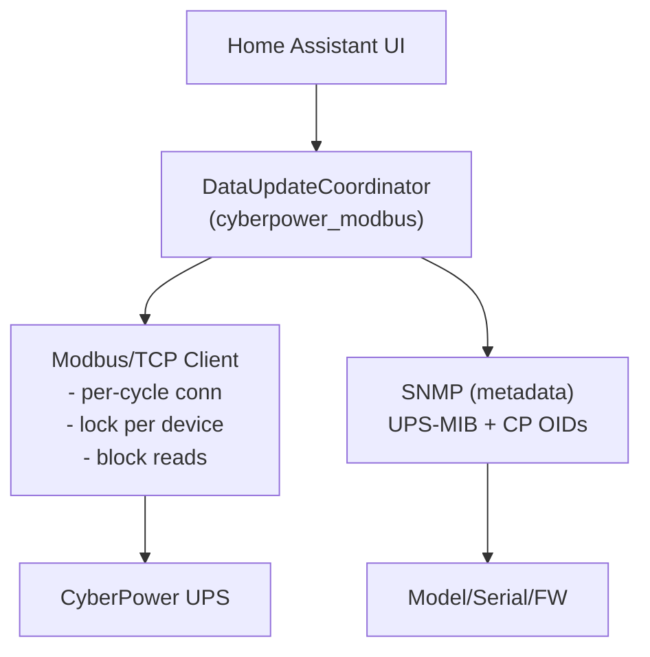

# CyberPower UPS Modbus Integration for Home Assistant

[](https://hacs.xyz/)
[](https://github.com/aburow/cyberpower-modbus-ha/actions/workflows/hacs.yaml)
[](https://github.com/aburow/cyberpower-modbus-ha/actions/workflows/hassfest.yaml)

A Home Assistant integration for monitoring CyberPower UPS devices via Modbus/TCP with SNMP-based metadata and device-type detection.

This custom-component does not require additional components such as NUT https://wiki.archlinux.org/title/Network_UPS_Tools

Modbus/TCP is an extremely efficient method for collecting bulk data at a high rate and is used in industrial automation services for
this purpose.

## Features

- **Single-phase UPS support** (tested)
- **Three-phase UPS support** (experimental/untested)
- **SNMP metadata**: model, serial, firmware via UPS-MIB and CyberPower enterprise OIDs
- **Local polling**: Modbus/TCP (port 502) + SNMP (port 161)
- **Block read optimization** with fallback to individual reads
- **Per-endpoint Modbus locking** to serialize I/O to the same device
- **Per-cycle connect/close** with reconnection and backoff handling
- **Pacing delays** for devices that require slower read cadence
- **Holding register polling** only (input registers are not supported on tested hardware)

## Architecture



## Installation

### Using HACS (Recommended)

1. Go to HACS in Home Assistant
2. Click the three-dot menu and select "Custom repositories"
3. Add repository: `https://github.com/aburow/cyberpower-modbus-ha`
4. Select "Integration" category
5. Install "CyberPower UPS Modbus"
6. Restart Home Assistant

### Manual Installation

1. Copy `custom_components/cyberpower_modbus/` to `config/custom_components/`
2. Restart Home Assistant
3. Go to Settings → Devices & Services → Integrations
4. Click "Create Integration"
5. Search for "CyberPower UPS Modbus"

## Configuration

1. Go to **Settings → Devices & Services → Integrations**
2. Click **Create Integration**
3. Search for and select **CyberPower UPS Modbus**
4. Configure:
   - **Host**: Modbus/TCP host name or address
   - **SNMP Community**: SNMP community string (default: "public")
   - **Device Name**: Friendly name (optional)
   - **Port**: Modbus/TCP port (default: 502)
   - **Unit ID**: Modbus unit ID (default: 1)
   - **Scan Interval**: Update interval in seconds (default: 10)

Device type (single/three-phase) is detected via SNMP (UPS-MIB input line count).

## Requirements

- Home Assistant 2024.1 or later
- CyberPower UPS with:
  - **Modbus/TCP** enabled (port 502)
  - **SNMP** enabled (port 161)
- Network connectivity to the UPS

## Testing Notes

- Single-phase register mapping is validated against a live CyberPower device.
- Three-phase register mapping is included but **untested**; treat as experimental.

## Troubleshooting

- **SNMP not returning metadata**: verify SNMP is enabled and community is correct.
- **Modbus connection errors**: confirm Modbus/TCP is enabled and port 502 is reachable.
- **Illegal function / input register errors**: the UPS only supports Modbus holding registers (FC03).
- Useful checks:
  - `ping <device-host>`
  - `nc -u <device-host> 161`
  - `telnet <device-host> 502`

### Debug logging

Add this to `configuration.yaml` to enable debug logs:

```yaml
logger:
  default: info
  logs:
    custom_components.cyberpower_modbus: debug
```

Useful debug entries to expect:
- `Modbus connect ok/failed in Xms`
- `Modbus close completed in Xms`
- `Waited X.XXXs for Modbus lock`
- `Block read succeeded: <block>`
- `Block read returned error <block>`
- `Applying backoff: <seconds>`

## License

See LICENSE file for details.
